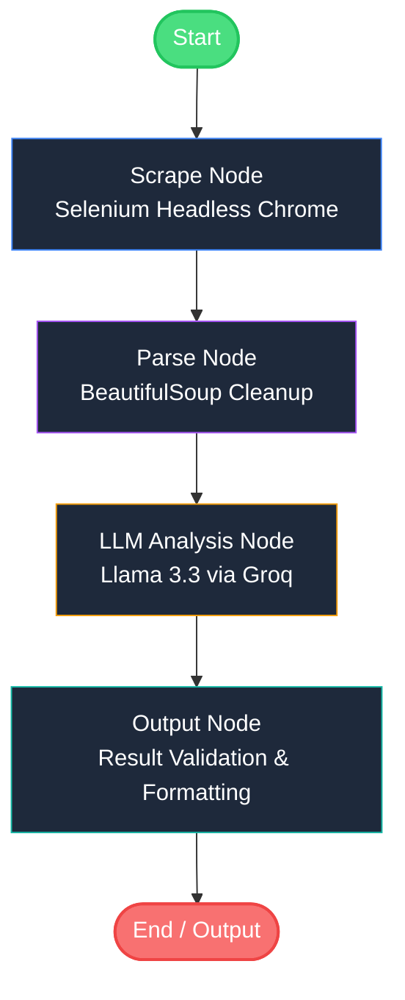

Web Scraping & Semantic Data Extraction Tool

AI web scraping application utilizing **Selenium** (dynamic rendering), **BeautifulSoup** (text extraction & cleanup), **LangChain & LangGraph** (agentic state workflow), and **Llama 3.3** via **Groq** for high-quality structured analysis.

---

Architecture & Workflow

The application employs **LangGraph** to model the execution flow as a deterministic state machine, ensuring clean segregation of concerns, error isolation, and step-by-step auditability.



### Key Components

1. **Streamlit UI (`app.py`)**: Renders a glassmorphic dashboard with a sidebar control center. Executes the LangGraph pipeline asynchronously, updating state checkpoints in real-time.
2. **Dynamic Web Scraping (`scraper.py`)**: Utilizes **Selenium** in headless mode with browser-mimicking user agents to load Javascript-heavy websites and extract raw HTML content.
3. **HTML Parsing (`parser.py`)**: Employs **BeautifulSoup** to strip layout clutter (styles, scripts, headers) and normalize whitespaces, optimizing the context window size before sending text to the LLM.
4. **Agentic Orchestrator (`workflow.py`)**: Coordinates the node execution sequence using **LangGraph**. If any node triggers an exception, the state flow isolates the error gracefully without crashing.
5. **AI Semantic Processor (`llm.py`)**: Leverages **LangChain's** LCEL chain format and **Groq's Llama 3.3 70B** model to execute semantic extractions based on the user's queries.

---

## ⚙️ Installation & Setup

### Prerequisites
- Python 3.10+ (tested on Python 3.13.3)
- Google Chrome browser installed (Selenium uses Selenium Manager to automatically locate the binary and download corresponding ChromeDriver)

### Setup Steps

1. **Clone/Move to the project directory**:
   ```bash
   cd C:/Users/imvc4/webscraping
   ```

2. **Set up Virtual Environment**:
   ```bash
   python -m venv venv
   ```
   *Activate the virtual environment:*
   - **Windows (PowerShell):** `.\venv\Scripts\Activate.ps1`
   - **Windows (CMD):** `.\venv\Scripts\activate.bat`
   - **Mac/Linux:** `source venv/bin/activate`

3. **Install Dependencies**:
   ```bash
   pip install -r requirements.txt
   ```

4. **Environment Configuration**:
   - Rename `.env.example` to `.env`
   - Set your Groq API Key:
     ```env
     GROQ_API_KEY=gsk_your_groq_api_key_here
     GROQ_MODEL_NAME=llama-3.3-70b-versatile
     ```

---

 Running the Application

Launch the Streamlit web server by running:
```bash
streamlit run app.py
```

Open `http://localhost:8501` in your browser. Enter a URL, select the extraction type, and click **Run AI Scraper Pipeline** to witness the agentic extraction in action!

---
File Structure

- [app.py](file:///C:/Users/imvc4/webscraping/app.py): Streamlit dashboard interface and session state manager.
- [workflow.py](file:///C:/Users/imvc4/webscraping/workflow.py): State graphs, transition rules, and execution steps for LangGraph.
- [scraper.py](file:///C:/Users/imvc4/webscraping/scraper.py): Headless Selenium webdriver options and scraping routines.
- [parser.py](file:///C:/Users/imvc4/webscraping/parser.py): BeautifulSoup text parser and tag decompilation utilities.
- [llm.py](file:///C:/Users/imvc4/webscraping/llm.py): LangChain ChatGroq model configurations and LCEL chains.
- [requirements.txt](file:///C:/Users/imvc4/webscraping/requirements.txt): Application dependencies list.
- [.env.example](file:///C:/Users/imvc4/webscraping/.env.example): Reference configuration template.
